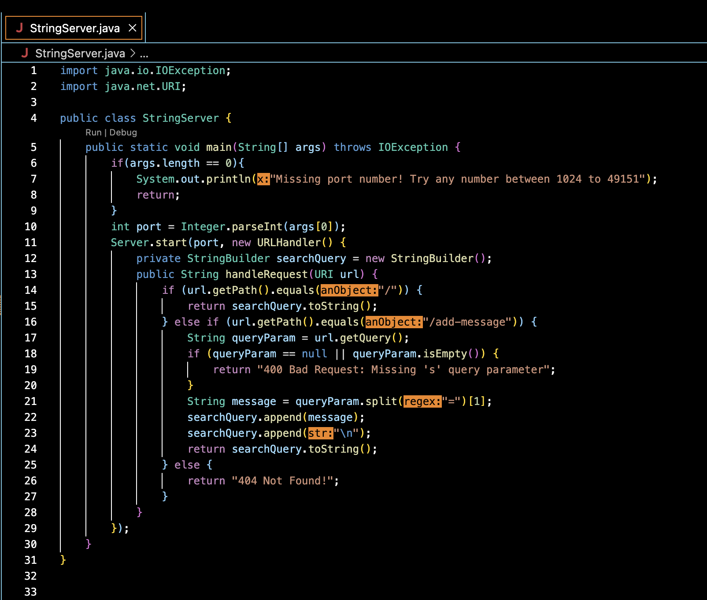
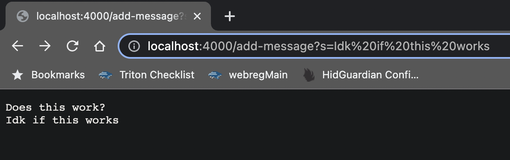
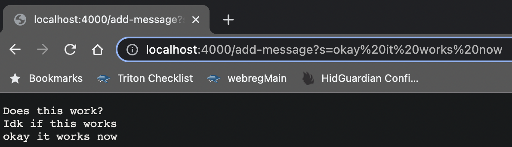
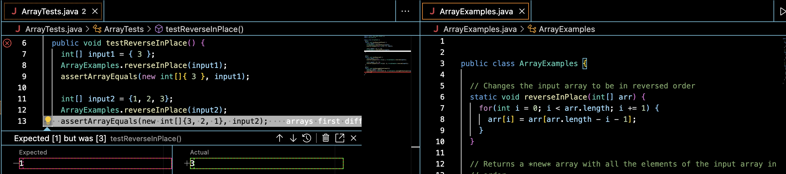

`StringServer.java`:

- `StringServer.java` contains a `main` method that firstly checks if a port number is provided when trying to run the server.
- Within the `main` method is another method called `Server.start` that takes the port number and passes it to the `URLHandler`
- `handleRequest` takes a URI object representing the incoming String as its parameter and returns a String representing the server's response to the request
1st `/add-message`:

- For this request, since the path does equal "/add-message" and the query isn't empty, "Idk if this works" is appended to `searchQuery`
2nd `/add-message`:

- For this request, since the path does equal "/add-message" and the query isn't empty, "okay it works now" is appended to `searchQuery`
```
  @Test
  public void testReverseInPlace(){
    //test that passes:
    int[] input1 = {3};
    ArrayExamples.reverseInPlace(input1);
    assertArrayEquals(new int[]{3}, input1);
  
    //test that fails:
    int[] input2 = {1, 2, 3}
    ArrayExamples.reverseInPlace(input2);
    assertArrayEquals(new int[]{3, 2, 1}, input2);
  }
```
An input of `{3}` does not provide an error when running the test while the bug is still in the code.

An input of `{1, 2, 3}` provides an error when running the test while the bug is still in the code.

Symptom:

Before(bug):
```
  static void reverseInPlace(int[] arr){
    for(int i = 0, i < arr.length; i += 1){
      arr[i] = arr[arr.length - i - 1];
    }
  }
```
After:
```
  static void reverseInPlace(int[] arr){
    int temp = 0;
    for(int i = 0, i < arr.length/2; i += 1){
      temp = arr[i];
      arr[i] = arr[arr.length - i - 1];
      arr[arr.length - i - 1] = temp;
    }
  }
```
When the bug was present in the code, the for loop was iterating through every item in the array instead of `arr.length / 2` and the array was not being updated. In the new for loop, the item at the current index gets stored in `temp` and at the end replaces it "mirror" in the array.

In the week 2 lab, I found it very interesting that I am easily able to create my own web servers. I also found it interesting that I am able to run those servers off of the UCSD remote servers.
