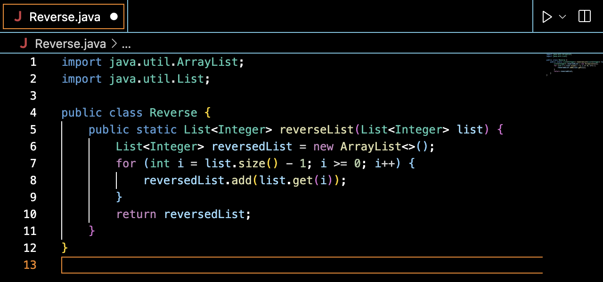

# Step 4: Log into ieng6
Keystrokes:
* `ssh, <space>, cs15lsp23hm, <shift> + 2, ieng6.ucsd.edu, <enter>`
* `thisisntmyrealpassword, <enter>`

The first set of keystrokes will write out `cs15lsp23hm@ieng6.ucsd.edu`

The second set will probably consist of using `<shift>` since passwords require uppercase letters and symbols

# Step 5: Clone your fork of the repository from your Github account
Keystrokes:
* `git, <space>, clone, <space>, https, <shift> + ;, //github.com/whatuptj/lab7, <enter>`

This set of keystrokes will write out `git clone https://github.com/whatuptj/lab7` which is the git clone command to clone a repository into your current directory

# Step 6: Run the tests, demonstrating that they fail
Keystrokes:
* `javac, <space>, -cp, <space>, ., <shift> + ;, lib/hamcrest-core-1.3.jar, <shift> + ;, lib/junit-4.13.2.jar, <space>, <shift> + 8, .java, <enter>`
* `java, <space>, -cp, <space>, ., <shift> + ;, lib/hamcrest-core-1.3.jar, <shift> + ;, lib/junit-4.13.2.jar, <space>, org.junit.runner., <shift> + j, <shift> + u, nit, <shift> + C, ore, <space>, <shift> + l, ist, <shift> + e, xamples, <shift> + t, ests, <enter>`

The first set of keystrokes will write out `javac -cp .:lib/hamcrestcore-1.3.jar:lib/juinit-4.13.2.jar *.java` which will compile .java files

The second set of keystrokes will write out `java -cp .:lib/hamcrestcore-1.3.jar:lib/juinit-4.13.2.jar org.junit.runner.JUnitCore ListExamplesTests` which runs the program for ListExamplesTests

# Step 7: Edit the code file to fix the failing test
* `vim, <space>, <shift> + l, ist, <shift> + e, xamples.java, <enter>`
* `<j>` x43
* `<l>` x11
* `<x>, <i>, <2>, <esc>`
* `<shift> + ;, <w>, <q>, <enter>`

The first set of keystrokes will write out `vim ListExamples.java` which allows you to open ListExamples.java in vim

The repeated `<j>` will move the cursor down
  
The repeated `<l>` will move the cursor right
  
`<x>` will delete "1", `<i>` will enter insert mode, `<2>` will type 2, `<esc>` returns you to normal mode

# Step 8: Run the tests, demonstrating that they now succeed
* `<up>, <up>, <up>, <enter>`
* `<up>, <up>, <up>, <enter>`

Using `<up>` on the keyboard writes previously ran commands

The first line should put the compile command in your line, and after hitting enter, will be the most recently used command, explaining why you will do the same amount of `<up>` commands.

# Step 9: Commit and push the resulting change to your Github account
im confused on this step :/ but will take the next week to figure it out
