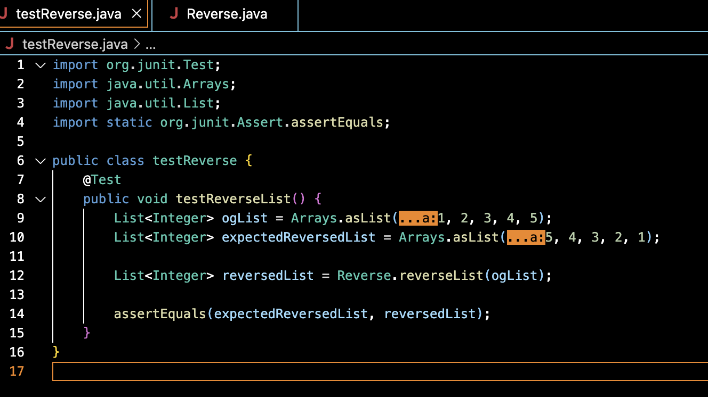
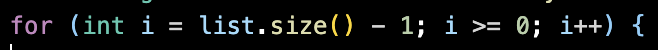
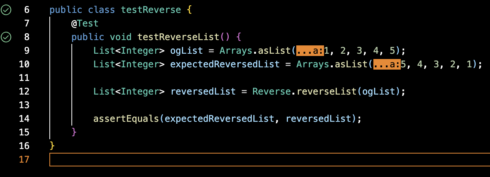

# New Question

## Debugging

What environment are you using (computer, operating system, web browser, terminal/editor, and so on)?
* I am using a 2022 M2 MacBook Air
* It's running macOS Monterey version 12.5
* I am also using the built in terminal in VSCode

Detail the symptom you're seeing. Be specific; include both what you're seeing and what you expected to see instead. Screenshots are great, copy-pasted terminal output is also great. Avoid saying “it doesn't work”.
* I intended the code to take a list and reverse the order of the list. In my tester, I had provided a list consisting of (1, 2, 3, 4, 5). What I had expected was (5, 4, 3, 2, 1), but instead had recieved an OutOfBounds error.

Detail the failure-inducing input and context. That might mean any or all of the command you're running, a test case, command-line arguments, working directory, even the last few commands you ran. Do your best to provide as much context as you can.
* Code:

* Tester:

# Response
Hi there! So according to the screenshots you had included in your post, it seems like they way you are trying to iterate through the list is incorrect since you are recieving an OutOfBounds error. If you look at your for loop, you may be able to see that you are starting at the length of the list - 1. So say your list has a length of 5, 5 - 1 = 4, counting from index 0, 1, 2, 3, 4 lands you at the last item in the list. In the last statement of your for loop, you are trying to increase the value of i, when you should really be decreasing it to iterate through all of the items in the list starting from the last item to the first. 

Here is a simple fix that you may use to iterate through the items in descending order:

This change should fix the OutOfBounds error and your expected output should be correct:

Hope this helps and let us know if you have any other questions!
